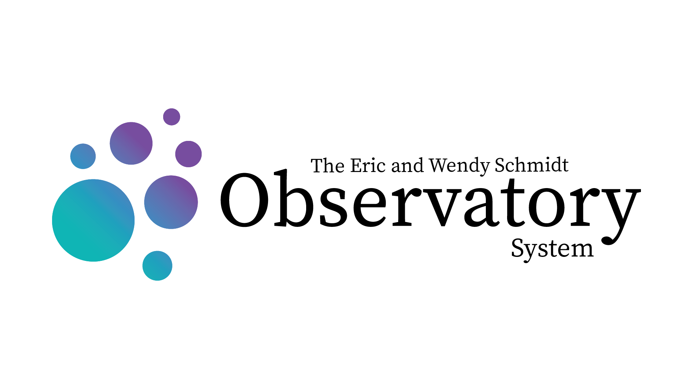

[](https://github.com/schmidt-observatories/wcc-sim/actions/workflows/tests.yml)

# wcc-sim
End-to-end image simulator and differential-photometry pipeline for the
Wide-field Context Camera (WCC) on Lazuli.

`wcc-sim` queries Gaia DR3 for a pointing, converts Gaia photometry to detector
count rates through the [wcc-etc](https://github.com/schmidt-observatories/wcc-etc)
instrument model, renders every star with the in-focus (Airy) or +1/+2-wave
defocus (Zemax Huygens) PSF plus its diffraction wings and the scattered-light
halo, adds photon/sky/dark/read noise with full-well and ADC saturation, and
writes a multi-extension FITS image (SCI + SATMASK + CAT + CLEAN) with a TAN
WCS. The sibling `wcc-phot` package extracts a relative light curve from a
series of such frames.

# Installation

## **1. Install wcc-etc**

`wcc_etc` provides the instrument model and is not on PyPI, so install it from
its repository first:
```sh
git clone git@github.com:schmidt-observatories/wcc-etc.git
cd wcc-etc && pip install -e . && cd ..
```

## **2. Clone and install wcc-sim**
```sh
git clone git@github.com:schmidt-observatories/wcc-sim.git
cd wcc-sim
pip install -e .
```

With optional extras:
```sh
pip install -e ".[test]"   # pytest
pip install -e ".[docs]"   # documentation build (Sphinx, nbsphinx, etc.)
```

Python 3.11 or newer is required. A default run queries the Gaia archive, so
it needs network access. Pass `cache_dir=` (CLI: `--cache-dir`) to keep the
Gaia result on disk so repeat runs work offline.

# Quick Start

```python
from wcc_sim import simulate_field

# Simulate one 90 s frame of the field at (RA, Dec) = (150.1, 2.2) deg on the
# Sony IMX455 detector in the r band, +1 wave defocused, and save it as FITS.
field = simulate_field(150.1, 2.2, sensorfilter="zwo:r", focus=1,
                       exptime=90, seed=42, output="field_1wave.fits")

field.image_adu       # the detector image (ADU)
field.catalog         # the Gaia table with pixel positions and count rates
field.params          # everything the run used (rates, noise, PSF, wing floor)
```

The same from the command line:
```sh
wcc-sim --ra 150.1 --dec 2.2 --sensorfilter zwo:r --focus 1 \
        --exptime 90 --seed 42 -o field_1wave.fits
```

Then recover a light curve from a series of frames of the same field:
```python
from wcc_phot import run_photometry

result = run_photometry(["f0.fits", "f1.fits", "f2.fits"], target=(150.1, 2.2),
                        method="aperture", n_ref=10)
result.lightcurve     # per frame: rel_flux_norm, errors, flags
```
```sh
wcc-phot f*.fits --ra 150.1 --dec 2.2 --method psf -o phot.fits --report report.pdf
```

`sensorfilter` is `kind:band` as in wcc-etc: `zwo:*` is the Sony IMX455
(9568 x 6380 px, 16.87 mas/pix) and `qcmos:*` the Hamamatsu HWK4123
(4096 x 2304 px, 20.64 mas/pix). `focus=0|1|2` selects in-focus, +1 wave or
+2 waves of defocus. `extended_sources=[SersicComponent(...)]` adds analytic
galaxy light and `chromatic=True` switches to spectrum-weighted PSFs (in focus
only).

# Tutorial
See the `notebooks/` directory for example tutorials (executed outputs
included; the Gaia queries they need are cached in `notebooks/gaia_cache/`,
so they run offline):

| Notebook | What it covers |
|---|---|
| `01_wcc_sim_example.ipynb` | Getting started: simulate a field, inspect the catalog, image and parameters, and verify count rates against wcc-etc. |
| `02_psf_focus_modes.ipynb` | In-focus Airy vs +1/+2-wave defocus PSFs and what they do to peak pixel and saturation. |
| `03_detectors_and_filters.ipynb` | The two detectors, the filter sets, and Gaia-to-count-rate conversion per spectral type. |
| `04_noise_and_saturation.ipynb` | Photon, sky, dark and read noise; full well and ADC clipping; the SATMASK extension. |
| `05_astrometry_and_catalogs.ipynb` | The TAN WCS and its round trip, where stars land, position angle, edges and user-supplied catalogs. |
| `06_cli_and_fits.ipynb` | The `wcc-sim` command line and the layout of the output FITS file. |
| `07_psf_wings.ipynb` | Diffraction wings beyond the PSF stamp: the wing model, seam smoothness, encircled energy and how far stars extend. |
| `08_wcc_phot_photometry.ipynb` | `wcc-phot`: simulate a dithered series, pick a target, aperture and PSF photometry, centroid drift, the live viewer. |

Ready-to-run CLI examples are in `scripts/example_*.sh`. Two end-to-end
validations live next to them: `scripts/transit_trappist1b.py` injects the
TRAPPIST-1b transit into the Gaia catalog, simulates 36 x 300 s defocused
frames, runs `wcc-phot` and checks the recovered depth; `scripts/cepheids_m101.py`
places synthetic Cepheids on the M101 disk (Sersic galaxy light plus the real
Gaia foreground) and recovers a period-luminosity relation.

# Notes
Instrument configuration (detectors, filters, throughput, PSFs, the stray-light
model) comes from wcc-etc and is not duplicated here. The one data product
wcc-sim ships is the azimuthally averaged scattered-light profile in
`src/wcc_sim/data/psfs/`, regenerated by `scripts/build_scatter_profile.py`.

## Documentation

The full documentation site (installation, a user guide, rendered tutorial
notebooks, a CLI reference and an auto-generated API reference) is built with
**Sphinx** and the *Read the Docs* theme. It lives under `docs/sphinx/`:

```bash
pip install -e ".[docs]"   # Sphinx + theme + nbsphinx (+ the package itself)
brew install pandoc        # or: conda install pandoc / apt-get install pandoc
cd docs/sphinx
make html                  # output in _build/html/index.html
```

A `.readthedocs.yaml` is included so the site builds automatically once the
repository is connected to Read the Docs.

## Tests

```sh
pip install -e ".[test]"
python -m pytest
```

## Acknowledgements
This work has made use of data from the European Space Agency (ESA) mission
*Gaia* (https://www.cosmos.esa.int/gaia), processed by the Gaia Data
Processing and Analysis Consortium (DPAC). Simulations are built on
[Astropy](https://www.astropy.org), [photutils](https://photutils.readthedocs.io),
[synphot](https://synphot.readthedocs.io) and
[dust_extinction](https://dust-extinction.readthedocs.io).
